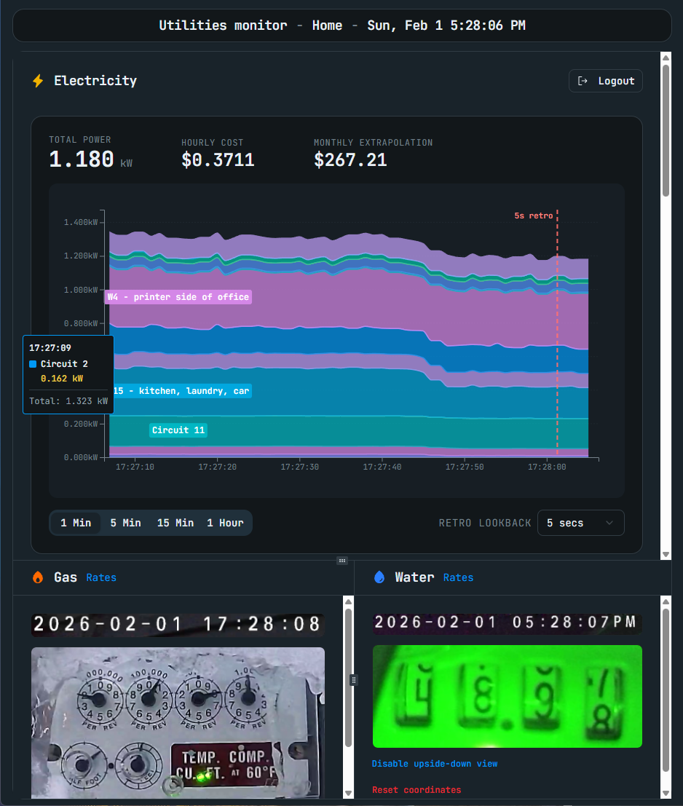
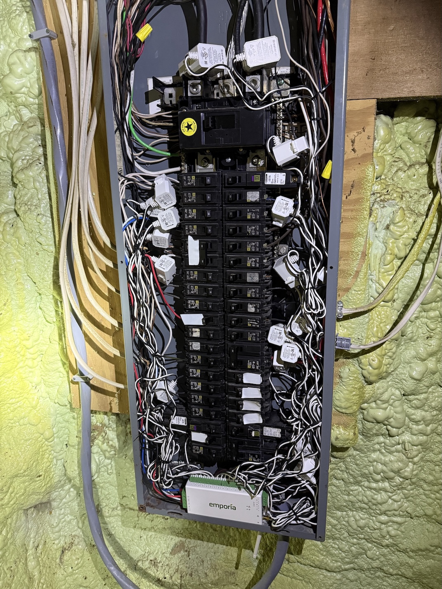
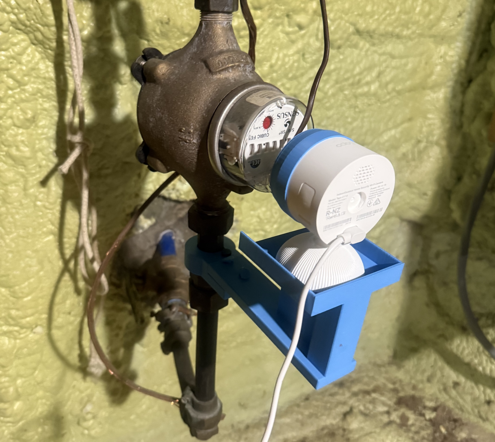
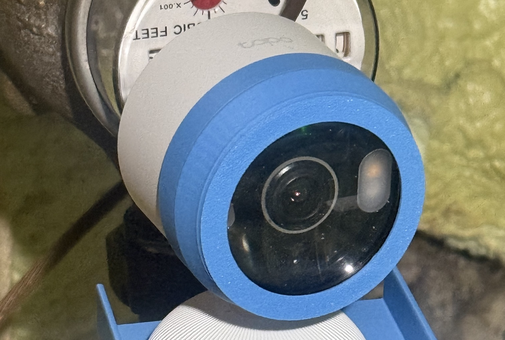
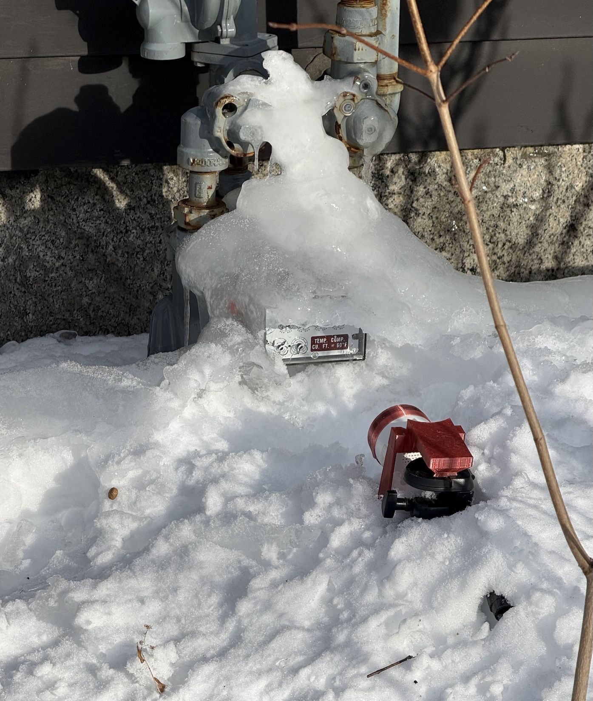
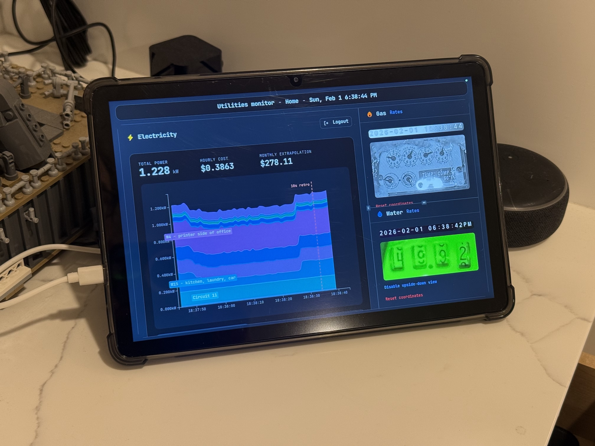

# Utilities Monitor Dashboard

Real-time utilities and energy monitoring dashboard for the home.



## Data Sources & Visualizations

| Utility | Data Source | Visualization |
|---------|-------------|---------------|
| ⚡ Electricity | [Emporia Vue](https://www.emporiaenergy.com/energy-monitors/) via [pyemvue](https://github.com/magico13/PyEmVue) | Real-time stacked graph of all circuits (feature not available in Emporia app!) |
| 🔥 Gas | IP camera view of meter | Live feed (future: dial reading → consumption graph) |
| 💧 Water | IP camera view of meter | Live feed (future: OCR reading → consumption graph) |

## Hardware
- [Emporia Vue hardware](https://www.amazon.com/dp/B0C79PNK84). You clip these on around the wires in your circuit breaker and it reads electricity consumption for each circuit, sends the data to Emporia in the cloud with an [Emporia account](https://web.emporiaenergy.com/), and then we request the data back.
- IP cameras looking at the gas and water meters. They need to support RTSP. I like the Tapo ones ([Tapo C120](https://www.amazon.com/Tapo-cameras-for-home-security/dp/B0CH45HPZT), [Tapo C113](https://www.amazon.com/Tapo-Indoor-Outdoor-Security-Camera/dp/B0F58PRJXV)). (I've also used Foscam, EZViz, and Wansview for RTSP, but Tapo seems fastest so I like Tapo the best.)
- [Diopter lenses](https://www.amazon.com/Vivitar-Close-Up-Macro-Filter-Pouch/dp/B004DRCEDW) are pretty important to get a good view of those small gauges in focus. I also 3d-printed something to hold the lens in front of the camera. (Link to come)
- The web dashboard can then be displayed in a prominent location in the home, triggered to wake on motion. I use the app [Fully Kiosk Browser](https://www.fully-kiosk.com/) with a cheap Android tablet to do the kiosk-y parts. With some work you should also be able to use an iPad and motion detectors and HomeKit, etc.

## Some pictures of my setup!


Emporia Vue monitors on my circuit breaker
> 

Tapo C113 looking at my water meter
> 

Closeup of diopter lens mounted to IP Cam
> 

Tapo C120 looking at my gas meter (after a snow storm - that's a tripod under the snow and it's attached with another 3d printed piece)
> 

Tablet running as a kiosk at home. With the [Fully Kiosk](https://www.fully-kiosk.com) app, the tablet's native camera actually acts as a motion detector. When someone walks by, the tablet wakes up and the web app becomes active. It goes to sleep after a few minutes of no motion.
> 


## 🏗️ Architecture

There is a React frontend to do web UX stuff, and a Python backend to do pyemvue API and video processing stuff. Since this webapp is designed to be used in a single home, credentials to Emporia are stored on the python server and there's no use case to switch accounts.


## 🚀 Quick Start

### Prerequisites

- **Node.js 18+** (for frontend)
- **Python 3.8+** (for backend)

### 1. Install Dependencies

```bash
# Frontend (Node.js)
npm install

# (Optional) Create and activate a virtual environment to keep dependencies scoped to this project.
# If you do this you'll need to activate the virtual environment (using the `source` or 
# `venv\Scripts\activate` command) each time you open a new terminal before running the backend server.
# macOS/Linux:
python3 -m venv venv
source venv/bin/activate
# Windows:
python -m venv venv
venv\Scripts\activate

# Install python dependencies
pip install -r requirements.txt

# Or install manually:
pip install flask flask-cors pyemvue pyjwt
```

### 2. Configure Environment Variables

Create an `.env` file to hold both frontend and backend settings:

```bash
cp .env.example .env
```

If you change `BACKEND_PORT`, remember to update `VITE_API_URL` to match.

### 3. Start the Python Backend Server

```bash
python3 backend_server.py
```

The backend will start on `http://localhost:5001`

### 4. Start the React Frontend

In a separate terminal:

```bash
npm run dev
```

Or if you want to run in preview mode
```bash
npm run build
npm run preview -- --host # will use port 4173
```

It will tell you what address it's serving.

### 5. Open in browser

1. Open the URL that the frontend told you (e.g., http://localhost:4173) in your browser.

## Personal dev notes

[Personal dev notes](personal-dev-notes.md)

## License

MIT License. See [LICENSE](./LICENSE).

